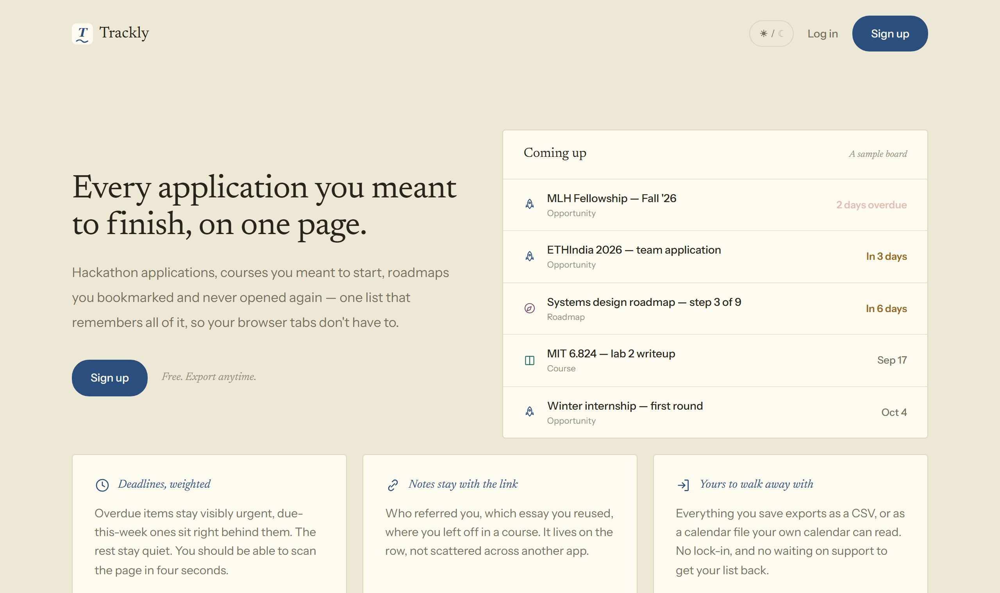

# Trackly

[](https://github.com/soumyaadubey/trackly/actions/workflows/ci.yml)

**One page for every application, course and roadmap you meant to get back to.**

### → [trackly-webapp.vercel.app](https://trackly-webapp.vercel.app/)



Hackathon applications, courses you started and drifted away from, roadmaps you
bookmarked and never opened again. Trackly keeps them in one list with a status,
a deadline, tags and notes, so they stop living in browser tabs.

Sign up on the live site and it's yours — your rows are private to your account.
No AI or LLM anywhere in the product. It runs entirely on free tiers.

## What it does

**Three kinds of thing, each with its own vocabulary.** Opportunities move
through *saved → applying → applied → interview* and end in accepted, rejected
or ghosted. Courses and roadmaps have their own status sets. Statuses aren't
shared across kinds just because they happen to share a name.

**Deadlines that sort themselves.** Overdue rows stay visibly urgent,
due-this-week sit behind them, and everything further out goes quiet.

**Your data leaves whenever you want.** A CSV of everything, and an `.ics` of
your live deadlines that any calendar app can read. Each event carries a
reminder the day before — which is how Trackly does notifications without
running a notification system.

**The rest.** Add an item by URL with a button that fetches the page `<title>` ·
free-text search across titles, notes *and* tags · click a tag to filter by it ·
Active and Archive views per section · delete with an undo window rather than a
confirm dialog · avatar, password change and self-serve account deletion ·
light and dark themes.

## How it's built

Next.js 16 (App Router, Server Actions) and TypeScript on the front, Supabase
Postgres with Row Level Security behind it, Tailwind 4 for styling, hosted on
Vercel. Vitest for unit tests, Playwright for checking rendered output.

A few decisions worth explaining, since they're the ones a reader is most likely
to want to undo:

**Dates are computed against the viewer's calendar day, on the server.** The
client writes its UTC offset to a cookie before first paint; the server reads it
back. Deadlines are therefore correct in the initial HTML instead of being
rewritten after hydration — which is what used to happen, and it made every row
visibly flip from `2026-09-11` to `Sep 11` on every page load. The client still
double-checks and corrects the first-ever visit, when no cookie exists yet.

**Date maths is UTC-anchored everywhere.** `daysBetweenDates` and `addDays` both
go through `Date.UTC` rather than arithmetic on local `Date` objects, because two
consecutive calendar days are 23 or 25 hours apart across a DST boundary and a
millisecond division rounds to the wrong day. The test suite runs a second time
under `TZ=Asia/Kolkata` to catch code that passes west of Greenwich and fails
east of it.

**Status sets are per-kind, and the filter proves it twice.** The SQL query
filters on the union of active statuses across all kinds — one round trip — and
then narrows in application code to the statuses active *for that row's kind*.
The union alone would show a completed course in a list of live opportunities.

**Every API route re-checks auth.** Authorization that lives only in middleware
is one config change, or one CVE-2025-29927, away from being absent.

**The landing page shows a real board.** It used to claim the app was scannable
without giving anyone anything to scan. The sample rows are generated from
offsets to the current date rather than fixed dates, so the urgency gradient
stays true instead of decaying into five overdue rows by next spring.

### Where things live

| Path | What's in it |
|---|---|
| `src/proxy.ts` | Next 16 "Proxy" (formerly `middleware.ts`) — refreshes the session, bounces signed-out traffic to `/login` while preserving where they were headed |
| `src/lib/items.ts` | The `Kind` config — status sets, labels, routes, field limits — plus the date helpers |
| `src/lib/ics.ts` | iCalendar generation: TEXT escaping, 75-octet line folding, exclusive end dates |
| `src/lib/layout.ts` | `PAGE_MEASURE`, the single width every page's chrome lines up on |
| `src/app/(app)/items/actions.ts` | Server Actions for create/update/delete/status, shared across all three kinds |
| `src/components/ItemsList.tsx`, `ItemForm.tsx` | The shared list and form, parameterised by kind |
| `supabase/schema.sql` | Full schema, RLS policies, storage setup |

## Security notes

Load-bearing decisions that shouldn't be "simplified" away:

- **`/api/fetch-title` validates the destination inside the connection's own DNS
  resolution**, not just with a pre-flight lookup — checking once and calling
  `fetch()` separately leaves a DNS-rebinding gap. Both halves matter: the
  pre-check is what stops a literal IP like `169.254.169.254`, because the
  dispatcher hook only fires for hostnames.
- **The avatars bucket enforces its own size and MIME limits.** A signed-in user
  holds a JWT that works directly against the Storage REST API, so validation
  living only in a server action is advisory. SVG is excluded deliberately: the
  bucket is public and an SVG is executable content.
- **`NEXT_PUBLIC_SITE_URL` is required in production**, so a forged `Host` header
  can't point an emailed reset token — a valid one — at another domain.
- **Server actions filter on `user_id` as well as row id.** RLS already
  guarantees ownership; the redundancy is there in case a policy is ever dropped
  during a migration.
- **CSV export neutralises formula injection.** RFC 4180 quoting alone doesn't
  stop Excel and Sheets evaluating a cell beginning with `=`, `+`, `-` or `@`.
- **`.ics` export escapes TEXT values**, so a title carrying a newline can't
  inject its own calendar properties. There's a test that tries.

## Known limitations

- **Deadlines are dates, not datetimes.** A hackathon deadline is usually
  "Nov 3, 11:59 PM AoE"; the app can only hold `2026-11-03`. This is the next
  real schema change.
- **No reminder emails.** The `.ics` export with its day-before alarms is a
  workaround, not a replacement — it only helps if you actually import it.
- **The calendar export is a download, not a subscription.** A live feed URL
  needs a per-user secret and a way to revoke it; that hasn't been designed, so
  re-export when things change.
- No CSV import, so there's no migration path *in* from a spreadsheet.
- No bulk actions, and no sort control — deadline-ascending, always.
- No OAuth. Email and password only.
- Rate limiting on `/api/fetch-title` is in-memory, so it's per-instance and
  resets on cold start. Vercel KV or Upstash is the upgrade path.
- Error reporting writes structured JSON to the log rather than to a service.
  `src/lib/errors.ts` is the single seam where Sentry would go.
- The CSP still allows `'unsafe-inline'` for scripts (the theme-flash guard) and
  styles (design tokens are applied through inline `style` attributes). Removing
  both is what would make the policy genuinely load-bearing.

## Development

```bash
npm install
npm run dev       # dev server
npm test          # unit tests
npm run lint      # eslint
npx tsc --noEmit  # typecheck
npm run build     # production build
```

CI runs lint, typecheck, tests and build on every push and PR
([`ci.yml`](./.github/workflows/ci.yml)). Two details there are deliberate:
`next typegen` runs before `tsc`, because `PageProps` and `LayoutProps` are
generated into `.next/types` and don't exist on a clean checkout; and the suite
runs twice, the second time under `TZ=Asia/Kolkata`, for the reason described
above.

`playwright` is a devDependency for checking rendered output. Unit tests can't
catch a component that renders an empty box, and this repo has shipped that bug.

<details>
<summary><b>Running your own instance</b></summary>

The live site is the intended way to use Trackly. These steps are for hacking on
it, or for standing up a private copy.

**1. Create a Supabase project** at [supabase.com](https://supabase.com) (free
tier). Open **SQL Editor → New query**, paste
[`supabase/schema.sql`](./supabase/schema.sql) and run it — that creates the
`items` table, locks it down with RLS so each user only sees their own rows, and
sets up the `avatars` storage bucket. If you already have an older schema, don't
re-run that file; apply the numbered files in
[`supabase/migrations/`](./supabase/migrations) in order instead.

Copy the **Project URL** and **publishable key** (`sb_publishable_…`) from
**Settings → API Keys**. Supabase requires email confirmation by default — you
can turn it off at **Authentication → Providers → Email → Confirm email** for
local testing, but leave it on if anyone else will use your instance.

**2. Set environment variables:**

```bash
cp .env.local.example .env.local
```

```
NEXT_PUBLIC_SUPABASE_URL=https://your-project-ref.supabase.co
NEXT_PUBLIC_SUPABASE_PUBLISHABLE_KEY=sb_publishable_xxxxxxxxxxxxxxxxxxxx
NEXT_PUBLIC_SITE_URL=http://localhost:3000
```

**3. Run it:**

```bash
npm install && npm run dev
```

**Deploying.** Import the repo at [vercel.com/new](https://vercel.com/new) and
add the same three variables, with `NEXT_PUBLIC_SITE_URL` set to the real
deployed origin. Add that domain under Supabase's **Authentication → URL
Configuration**, or password-reset links won't work. Also turn on
**Authentication → Secure password change** and set a minimum password length of
8 to match the client — the app can't enforce either on its own.

</details>

## License

[MIT](./LICENSE). Use it, fork it, ship your own version of it.
