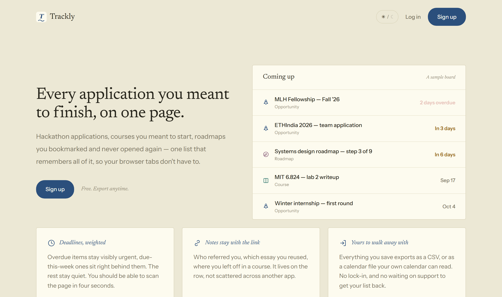

# Trackly

[](https://github.com/soumyaadubey/trackly/actions/workflows/ci.yml)

Track applications, courses, and learning roadmaps with statuses, deadlines,
next steps, tags, and notes. Keep personal opportunities and learning plans in
one place.

**[Open Trackly](https://trackly-webapp.vercel.app/)** ·
[Architecture](docs/architecture.md) · [Verification](docs/verification.md)



The landing page shows sample data. Sign in to save items and see your personal
Overview dashboard. The features below describe the current source tree; hosted
deployment and provider verification are recorded separately in
[Verification](docs/verification.md).

## Features

- Separate status workflows for opportunities, courses, and roadmaps.
- Overview dashboard with overdue and upcoming deadlines and next steps.
- Date-only deadlines and dated next steps: interview, follow-up, result, or other.
- Active/archive views, search across titles, notes, and tags, and status, tag,
  overdue, and upcoming filters. Lists show 25 items per page.
- URL title autofill and saved website links that open in a new tab from item
  titles. Item lists provide a separate Edit action.
- Inline status updates, edit-conflict detection that preserves your draft, and
  deletion with confirmation and undo that survives list navigation.
- Paginated CSV export of all items and downloadable ICS calendars for active
  items' deadlines and next steps. Calendar events include a day-before alarm;
  whether it appears depends on the calendar client and import settings.
- Email/password signup, email confirmation, sign-in, logout, and password recovery.
- Profile names, photo upload with crop/zoom controls, password changes, and
  account deletion after password verification.
- Light and dark themes.

## Engineering

Next.js 16 App Router, React, TypeScript, Tailwind CSS 4, and Supabase
Postgres/Auth/Storage. The hosted application uses Vercel.

- **Ownership and validation:** database row-level security and constraints,
  with additional ownership filters in item mutations.
- **Date handling:** UTC-anchored calendar arithmetic and a viewer-offset cookie
  for server-rendered deadline labels, with a client correction when needed.
- **Exports:** batches ordered by ID, count-change detection, and explicit errors
  for failed reads or exports above the 16 MiB source-data limit.
- **Verification:** Vitest unit/contract tests, Playwright workflows with local
  Auth/Storage/data fixtures, disposable PostgreSQL schema and ownership checks,
  and an opt-in authentication test against a disposable Supabase project.

See [architecture and tradeoffs](docs/architecture.md) for the request flow and
implementation boundaries. [Verification results](docs/verification.md) distinguish
observed checks from work that still needs database or deployment validation.
Usage, retention, and performance benchmarks have not yet been established.

## Current limitations

- Undo is held in browser memory until dismissed, the page is reloaded, or the
  shared app layout is left. There is no persistent trash or deletion history.
- Exports are bounded to 16 MiB of source data and are not a database snapshot.
  Concurrent edits that preserve the record count can span different versions.
- Deadlines have no time or timezone. Reminder emails and calendar subscriptions
  are not implemented.
- CSV import, custom sorting, bulk actions, and Google sign-in are not implemented.
- URL lookup rate limits are per process. Errors go to structured server logs;
  external error reporting and alerts are pending.
- The production CSP permits inline scripts and styles. Further hardening and
  browser verification are planned.
- Real-provider authentication, email delivery, and hosted migration state require
  separate acceptance checks. Use the deployment guide for installation and rollout.

## Project structure

```text
.github/workflows/ci.yml       Quality and isolated integration checks
src/
  app/
    (app)/                    Authenticated layout and item/profile routes
      courses/                Course lists and creation
      opportunities/          Opportunity lists and creation
      roadmaps/               Roadmap lists and creation
      items/                  Shared mutations and [id]/edit route
      profile/                Account forms and actions
    (legal)/                  Privacy and terms pages
    api/                      CSV export, ICS calendar, and URL title lookup
    auth/confirm/             Email confirmation and recovery callback
    login/                    Sign-in/signup form and actions
    reset-password/           Recovery form and actions
    page.tsx                  Landing page or signed-in Overview
    layout.tsx                Root layout, metadata, fonts, and theme setup
    globals.css               Shared styles and design tokens
  components/
    home/                     Dashboard and landing-page board
    items/                    Lists, forms, status, deadlines, and undo
    layout/                   Header, footer, navigation, and account menu
    ui/                       Logo, icons, and theme toggle
  lib/
    supabase/                 Server, admin, and session-proxy clients/helpers
    *.ts                      Shared auth, validation, dates, avatars, and exports
  proxy.ts                    Session refresh and navigation entry point
scripts/
  helpers/                    Shared browser-test fixture and assertions
  test-auth-browser.mjs       Isolated browser workflows
  test-auth-provider.mjs      Opt-in disposable Supabase authentication checks
  test-schema.mjs             Disposable PostgreSQL schema/migration/RLS checks
supabase/
  migrations/                 Ordered migrations 0001 through 0006
  schema.sql                  Current schema snapshot
docs/                         Architecture, deployment, verification, and screenshot
public/                       Static social-preview image
```

Tests live beside the code they verify. Framework and tool configuration stays at
the root so standard Next.js, TypeScript, ESLint, and Vitest commands work directly.

## Run locally

1. Install dependencies with `npm ci` using a compatible Node.js version
   (CI is configured to use Node 20; recent local checks used Node 24.18.0).
2. Create a disposable Supabase development project. Follow the
   [fresh installation instructions](docs/auth-deployment.md#fresh-installation)
   to apply migrations and configure authentication.
3. Copy `.env.local.example` to `.env.local` and fill in the variables below.
4. Run `npm run dev` and open `http://localhost:3000`.

| Variable | Purpose | Requirement |
| --- | --- | --- |
| `NEXT_PUBLIC_SUPABASE_URL` | Supabase project URL | Required |
| `NEXT_PUBLIC_SUPABASE_PUBLISHABLE_KEY` | Browser-safe Supabase project key | Required |
| `NEXT_PUBLIC_SITE_URL` | Canonical app origin for email links | Use `http://localhost:3000` locally; required in production |
| `SUPABASE_SECRET_KEY` | Server-only admin credential for verified account deletion | Required for account deletion; never expose in browser code or untrusted previews |

Keep real credentials out of Git. Production also requires matching email
templates, redirect allowlists, provider settings, and migrations; use the
[authentication deployment guide](docs/auth-deployment.md).

## Development checks

```sh
npm run lint
npx next typegen
npx tsc --noEmit
npm test
npm run build
```

On Windows PowerShell, use `npm.cmd` and `npx.cmd` if script execution policy
blocks the `.ps1` launchers. Generate route types before typechecking a fresh
checkout.

[CI](.github/workflows/ci.yml) is configured to run these checks on pushes to
`main` and pull requests, including a second unit-test run under
`TZ=Asia/Kolkata`. Its build uses placeholder Supabase settings. A separate
integration job runs the isolated browser suite and disposable PostgreSQL
schema/migration/ownership checks. Workflow configuration alone does not establish
that a particular CI run passed.

Additional checks:

| Command | Scope and prerequisites |
| --- | --- |
| `npm run test:auth-browser` | Auth, profile, item, export, pending/error/retry, and keyboard/mobile workflows using local fixtures. Install Chromium with `npx playwright install chromium`; keep ports 3111 and 54329 free and stop other Next.js dev servers for this checkout. |
| `npm run test:schema` | Schema/migration parity, constraints, and database/storage ownership policies in its own disposable PostgreSQL container. Requires a running Docker engine; uses no hosted credentials. |
| `npm run test:auth-provider` | Authentication acceptance against an explicitly configured disposable Supabase project. Follow the [test settings and scope](docs/auth-deployment.md#verification). |

Local fixture checks do not establish production email delivery, hosted provider
settings, or deployment status. Dated local results and unrun checks are recorded
in [Verification](docs/verification.md).

## Planned work

1. Complete real-provider and deployment acceptance checks.
2. Extend integration coverage and verify behavior against hosted Supabase.
3. Provide an interactive demo and run a small user pilot to guide product priorities.
4. Implement timezone-aware deadlines and durable reminders with retries and cancellation.
5. Publish reproducible performance measurements and measured product outcomes.

CSV import and further organization features will be prioritized from user feedback.
The items above are planned work, not shipped features or measured results.

## License

[MIT](LICENSE).
