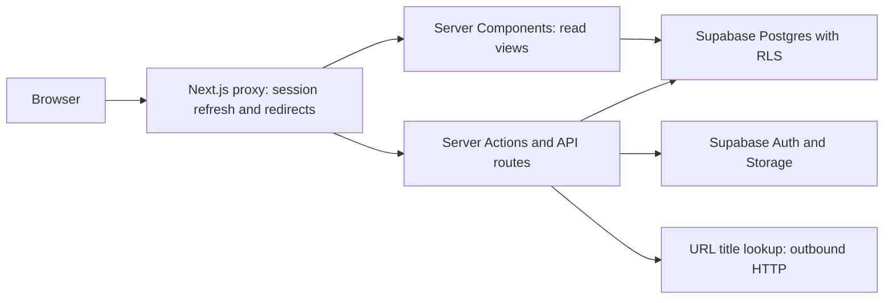

# Architecture and tradeoffs

This describes the working tree reviewed on 2026-09-28. It is not a record of
what is deployed; see [verification](verification.md) and
[authentication deployment](auth-deployment.md).

## Request flow

The proxy handles session refresh and navigation. Actions and data API routes
check authentication where they perform work. Ordinary database requests use
the user's session; row-level security constrains ownership. Signed-in clients
can also call Supabase directly, so application validation alone cannot enforce
database or storage rules.

Account deletion uses a separate server-only admin client after password
verification. That credential has broad project authority; its use is restricted
in application code, not by a narrowly scoped credential. It must not be reused
for ordinary item queries.

## Data model and queries

`items` stores a `kind` discriminator, owner, title, URL, status, tags, date-only
deadline, notes, and timestamps. A database constraint restricts statuses by kind.
Sharing the table and components keeps the three workflows consistent.

List views filter by kind, status, search, and tags. A generated search column
and trigram index support substring search. Composite indexes cover owner/kind/
deadline queries, and a GIN index supports tag membership. Index definitions are
not performance evidence; query plans and benchmarks remain to be recorded.

Dashboard and calendar queries filter on the union of active statuses, then check
each row against its kind in application code. With the current configuration,
the union already excludes completed courses; the second check is defensive.

Pagination currently uses offsets and deadline ordering without a unique
tie-breaker. Counts are exact. Stable ordering, export pagination, and measured
query performance are outstanding work.

Numbered migrations are the setup path documented today. `schema.sql` is intended
to represent the full state, but its generated search expression differs from
migration 0002. Fresh-install and upgrade equivalence still need a database test.

## Calendar dates

Date helpers use UTC-anchored arithmetic on calendar dates to avoid treating
every local day as exactly 24 hours. The server computes the viewer's day from
a previously set UTC-offset cookie. The browser writes that cookie and checks
the rendered result against its own local day.

A cookie written in a response cannot inform the request that produced it. The
first visit therefore falls back to UTC; missing or stale offsets may require
a client correction. The offset is not an IANA timezone, and an open page does
not currently subscribe to midnight rollover. Timed deadlines and durable
reminders require additional schema and scheduling work.

## External input and exports

URL title lookup checks resolved destinations both before the request and during
connection DNS resolution. It refuses redirects and applies response/time limits.
The literal-IP pre-check must remain because those targets bypass hostname lookup.
IP classification and connection cleanup need dedicated regression coverage.
The current in-memory rate limiter does not coordinate multiple instances.

CSV generation quotes fields and prefixes selected formula-leading characters.
ICS generation escapes text, folds lines, and includes all-day deadlines with
alarms. Both routes currently issue a single database request, so they cannot
guarantee complete exports above the API row limit. ICS downloads do not stay
in sync with subsequent edits.

## Account lifecycle and diagnostics

Recovery actions require recent provider-verified recovery claims and a live-user
check. Password changes reauthenticate and submit the current password to the
provider. Provider enforcement must be configured and tested separately.

Deletion removes avatar objects through the Storage API before deleting the Auth
user; item ownership references cascade deletion. Storage and Auth operations
are not atomic. A partial failure can remove photos while retaining the account,
and the caller must be able to retry. Migration 0003 removes the older deletion RPC.

Structured error reporting attaches a reference for diagnosis. Hosted alerting,
log-redaction verification, and operational measurements remain planned work.

## Main files

| Path | Responsibility |
| --- | --- |
| [src/proxy.ts](../src/proxy.ts) | Proxy entry point |
| [src/lib/auth.ts](../src/lib/auth.ts) | Shared authentication helpers |
| [src/lib/items.ts](../src/lib/items.ts) | Kind configuration, validation, date helpers |
| [item actions](../src/app/(app)/items/actions.ts) | Item mutations |
| [ItemsList.tsx](../src/components/items/ItemsList.tsx) | List queries and rendering |
| [src/lib/ics.ts](../src/lib/ics.ts) | Calendar serialization |
| [src/lib/delete-account.ts](../src/lib/delete-account.ts) | Account cleanup |
| [migrations](../supabase/migrations/) | Database changes in order |

## Verification boundaries

Unit tests cover helpers and mocked contracts. The browser auth script uses a
local fixture; it cannot prove hosted provider behavior. A separate opt-in script
targets a disposable Supabase project. Database ownership, migration equivalence,
complete CRUD browser flows, and load testing are still pending. See the
[verification record](verification.md) for dates and evidence.
